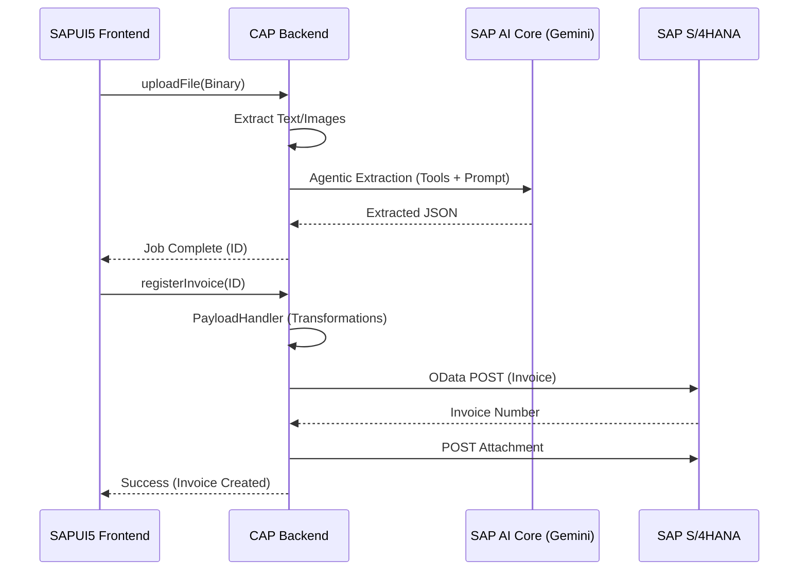

# Technical Documentation - AP Invoice SAP CAP Architecture

This document provides a granular, file-by-file breakdown of the AP Invoice system logic. It is designed for developers to understand the internal workings of the code for maintenance and evolution.

---

## 1. Backend Architecture & Service Layer

### 1.1 `srv/service.cds` - Service Definition
This file defines the OData V4 service interface. It exposes entities for documents, configurations, and actions for processing.

- **Actions**:
    - `uploadFile(file: Binary, countryCode: String, companyCode: String)`: Main entry point for PDF processing.
    - `uploadXml(file: Binary, countryCode: String, companyCode: String)`: Entry point for XML (FatturaPA/Peppol) processing.
    - `uploadZip(file: Binary, countryCode: String, companyCode: String)`: Batch processing for multiple documents.
    - `registerInvoice(id: UUID)`: Trigger for SAP S/4HANA OData registration.
    - `syncDataFromAI(id: UUID)`: Polling action to check processing status.
- **Configurations**: Exposes `Countries`, `DocumentAIFields`, `ODataFields`, and `FieldMappings` for the metadata-driven engine.

### 1.2 `srv/service.js` - Dispatcher Logic
The main class `APInvoiceService` inherits from `cds.ApplicationService`. It acts as a router, delegating requests to specific handlers.

- **Initialization (`init`)**:
    - Sets up references to all handlers: `PDFHandler`, `XmlHandler`, `PayloadHandler`, `ConfigHandler`, and `ZipHandler`.
    - Binds handlers to service events (actions and CRUD).
- **Event Handling**:
    - `on('uploadFile', ...)` -> calls `PDFHandler.uploadFile`.
    - `on('registerInvoice', ...)` -> calls `PayloadHandler.registerInvoice`.
    - `on('getCountryFieldConfig', ...)` -> calls `ConfigHandler.getCountryFieldConfig`.

### 1.3 `db/schema.cds` - Data Model
The persistence layer is managed via SAP HANA. Key entities include:
- **`DocumentStatusBtp`**: The central log of all processed documents. Stores raw extraction JSON, SAP response payloads, and job statuses.
- **`Countries`**: Stores country-specific AI parameters (Prompt, Model, Temperature) and XML grafting tags.
- **`CountryFieldConfig`**: Defines the "Source of Truth" for which fields are visible/mandatory per country and scenario.
- **`ODataFields`**: A dictionary of available SAP S/4HANA fields, synchronized via EDMX import.
- **`FieldMappings`**: Links Document AI fields to OData fields and contains the ordered `MappingSteps`.
- **`ConfigLocks`**: Implements the pessimistic locking mechanism for admin operations.

---

## 2. Document Processing & AI Extraction

### 2.1 `srv/handlers/PDFHandler.js` - PDF Workflow
This file manages the lifecycle of a document from upload to extraction.

#### Key Functions:
- **`uploadFile(req, entities)`**:
    - **Step 1**: Validates `countryCode` and `companyCode`.
    - **Step 2**: Creates an entry in `DocumentStatusBtp` with status `Processing`.
    - **Step 3**: Retrieves `CountryConfig` (System Prompt, AI Model settings).
    - **Step 4**: Calls `processDocument` asynchronously (returns 200 immediately to the UI).

- **`processDocument(req, entities, docId, ...)`**:
    - **Prompt Building**: Iterates over `FieldMappings` for the selected country to build a dynamic prompt.
    - **Text/Image Extraction**: Calls `PDFService.extractTextOrImages`.
    - **AI Call**: Invokes `AICoreService.extractDataLikeAgent` using LangGraph.
    - **Data Persistence**: Saves the extracted JSON and logs into `DocumentStatusBtp`.

### 2.2 `srv/handlers/ZipHandler.js` - Batch Processing
Handles the logic for bulk uploads.
- **`uploadZip`**: 
    1. Unzips the archive using `node-stream-zip`.
    2. Identifies files (PDF or XML).
    3. Sequentially triggers the extraction for each file.
    4. Creates separate `DocumentStatusBtp` entries for each file in the ZIP.

### 2.3 `srv/handlers/XmlHandler.js` - XML Engine
Standardizes structured XML data (like Italian FatturaPA) into the same internal format used by the AI.

#### Key Functions:
- **`uploadXml(req, entities)`**:
    - Parses the XML buffer using `xml2js`.
    - **Node Grafting**: Recursive search for the `xmlReferenceTag` defined in the country configuration.
    - **Mapping**: Maps XML paths (defined in `DocumentAIField.fieldName`) to the target schema.
    - **Normalization**: Ensures dates and amounts are in standard ISO/Decimal formats.

### 2.4 `srv/lib/PDFService.js` - Low-level Parsing
- **`extractTextOrImages(buffer)`**:
    - Uses `pdf-parse` for digital text.
    - Uses `pdf-to-img` for Vision/OCR if text extraction is low resolution.

---

## 3. The Transformation & Registration Engine

### 3.1 `srv/handlers/PayloadHandler.js` - The Core Orchestrator
This transforms extracted data into SAP OData payloads.

#### Logic Breakdown of `generateInvoicePayload`:
1.  **Scenario Detection**: Checks `PurchaseOrder` presence -> MM vs FI.
2.  **Field Mapping Loop**: Iterates through `FieldMappings` filtered by scenario.
3.  **Step Execution**: Calls `executeSteps` to run transformation chains.

#### `executeConversion(func, rawValue, params, ...)`:
- **Internal Logic**: `concatenate`, `ifthenelse`, `formatDate`, `sum`/`multiply`.
- **External Calls**: Uses BTP Destinations to call external OData services.

---

## 4. Configuration & Metadata Management

### 4.1 `srv/handlers/ConfigHandler.js` - Administration Logic
- **EDMX Parsing**: Populates `ODataFields` from S/4HANA metadata.
- **Pessimistic Locking**: `acquireLock` and `saveConfiguration` check locks.
- **Saving Logic**: Synchronizes UI state with `CountryFieldConfig` and `FieldMappings`.

---

## 5. UI / Frontend Architecture (SAPUI5)

### 5.1 `app/ap_invoice_extraction/webapp/controller/Detail.controller.js`
- **`_loadConfiguration()`**: Fetches metadata for dynamic form.
- **`_mapPayloadToUI()`**: Transforms nested JSON to flat model for binding.
- **Aggregation Logic**: Groups line items by PO/Item for MM scenario.

---

## 6. Deep Dive: `srv/handlers/PayloadHandler.js` Logic

### 6.1 XML Pre-processing & Grafting
Handles embedded documents in XML wrappers by recursively searching for specific business nodes.

### 6.2 Value Lookup Strategy (`getMappingValue`)
Hierarchical search: XML Raw -> Extracted Header -> Extracted Item -> Fallback.

### 6.3 Transformation Step Chain (`executeSteps`)
Executes sequential `MappingSteps`, passing results through a pipeline of conversion functions.

### 6.4 Tax Sanitization
Prunes `TaxDataSet` entries not referenced by line items to ensure SAP compatibility.

---

## 7. Deep Dive: `Detail.controller.js` (Frontend)

### 7.1 Model Strategy
Uses a flat `editableData` model with encoded keys (`Header___Field`) for complex binding.

### 7.2 Manual Scenario Switching
Allows runtime conversion between MM and FI structures while preserving user edits where possible.

---

## 8. Data Flow Summary

---
*Document produced for technical knowledge transfer.*
