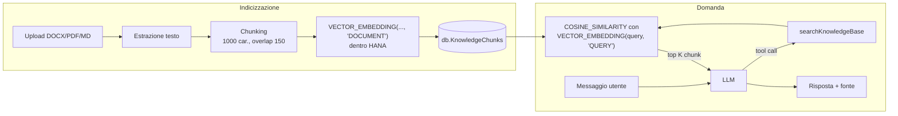

# Chatbot e knowledge base (RAG)

Questo documento descrive come funziona il chatbot di *AP Invoice Extraction* e, in
particolare, come recupera dal database il contesto da passare al modello: dal
caricamento di un documento DOCX, PDF o Markdown fino alla scelta dei passaggi che
arrivano all'LLM.

Per la struttura generale del layer chat (configurazione, storico, gestione errori) vedi
anche [README.md](README.md).

## 1. Panoramica

Il chatbot segue lo schema *Retrieval-Augmented Generation* con recupero **guidato dal
modello**: il contesto non viene iniettato automaticamente a ogni messaggio. È l'LLM a
decidere, turno per turno, se chiamare il tool `searchKnowledgeBase` e con quale query.

Le parti coinvolte:

| Fase | File | Cosa fa |
|------|------|---------|
| Upload | [srv/handlers/KnowledgeBaseHandler.js](../handlers/KnowledgeBaseHandler.js) | Valida e salva il file, avvia l'elaborazione in background |
| Indicizzazione | [srv/lib/KnowledgeBaseService.js](../lib/KnowledgeBaseService.js) `processDocument()` | Estrae il testo, lo divide in chunk, calcola gli embedding |
| Chunking | [srv/lib/TextChunker.js](../lib/TextChunker.js) | Divide il testo in pezzi sovrapposti |
| Ricerca | [srv/lib/KnowledgeBaseService.js](../lib/KnowledgeBaseService.js) `search()` | Ricerca per similarità vettoriale in HANA |
| Tool | [ChatbotTools.js](ChatbotTools.js) | Espone la ricerca al modello come `searchKnowledgeBase` |
| Agente | [ChatbotAgent.js](ChatbotAgent.js) | Loop LangGraph modello ↔ tool |
| Prompt | [ChatbotPrompts.js](ChatbotPrompts.js) | Regole su quando cercare e come usare i risultati |



## 2. Modello dati

Definito in [db/schema.cds](../../db/schema.cds):

- **`db.KnowledgeDocuments`**: il file caricato (`content` come `LargeBinary`), il nome,
  il tipo, lo stato (`Uploaded` → `Processing` → `Ready` | `Error`), l'eventuale
  messaggio di errore e il numero di chunk.
- **`db.KnowledgeChunks`**: un record per chunk, con `document_ID`, `chunkIndex`
  (posizione nel documento), `content` (`String(5000)`, cioè `NVARCHAR`, perché è l'input
  di `VECTOR_EMBEDDING`, che non accetta `NCLOB`) ed `embedding` (`Vector(768)`, che su
  HANA diventa `REAL_VECTOR(768)`, la dimensione del modello `SAP_NEB.20240715`).

In `CatalogService` la proiezione `KnowledgeDocuments` esclude `content` e `chunks`:
né il file né i chunk sono mai esposti via OData.

## 3. Caricamento e indicizzazione

### 3.1 Upload

L'action `uploadKnowledgeDocument(file, fileName)` riceve il file in base64 (un prefisso
`data:...;base64,` viene tollerato) e:

1. accetta solo le estensioni `.pdf`, `.docx` e `.md` (tabella `SUPPORTED` in
   `KnowledgeBaseService.js`). Il tipo MIME salvato (`application/pdf`,
   `application/vnd.openxmlformats-officedocument.wordprocessingml.document`,
   `text/markdown`) viene ricavato dall'estensione, non da quello inviato dal browser,
   che per i `.md` è spesso vuoto. Anche il `FileUploader` della UI filtra le stesse
   estensioni (`fileType="pdf,docx,md"`);
2. rifiuta file vuoti o più grandi di `maxFileSizeMb` (default 20 MB, HTTP 413);
3. inserisce il record in `KnowledgeDocuments` con stato `Uploaded`;
4. registra l'elaborazione su `req.on('succeeded')` e la lancia con `setImmediate`.

L'elaborazione parte **solo dopo il commit** della transazione di upload, così il job in
background trova sempre la riga del documento. La risposta all'utente è immediata; la UI
controlla l'avanzamento leggendo `KnowledgeDocuments.status`.

`reprocessKnowledgeDocument(id)` rilancia la stessa pipeline (rifiutata con 409 se il
documento è già in `Processing`). Cancellando un documento, un handler `before DELETE`
elimina esplicitamente i suoi chunk, perché i chunk non fanno parte della proiezione di
servizio e la deep delete non li raggiungerebbe.

### 3.2 `processDocument()`

Ogni passo di stato usa una propria transazione, così lo stato è visibile subito alla UI.

1. Stato → `Processing`.
2. Lettura del file. Su HANA il `LargeBinary` arriva come stream legato a un LOB locator
   valido solo a transazione aperta: il contenuto viene letto per intero in un `Buffer`
   **prima** del commit.
3. **Estrazione del testo**:
   - DOCX: `mammoth.extractRawText()` (solo testo, formattazione ignorata);
   - PDF: `PDFService.extractTextOrImages()` (pdfjs). Se il PDF non contiene testo
     selezionabile (es. una scansione), il documento va in errore: non c'è OCR;
   - Markdown: il file viene letto come UTF-8 e ripulito da `markdownToText()` (vedi
     §3.3).
4. **Chunking** con `chunkText()` (vedi §4).
5. In **un'unica transazione**:
   - cancellazione dei chunk precedenti del documento (per il reprocess);
   - inserimento dei nuovi chunk (`chunkIndex` = ordine nel documento);
   - calcolo degli embedding (vedi §5).
   
   Se uno di questi passi fallisce, la transazione viene annullata e i chunk precedenti
   restano intatti.
6. Stato → `Ready` con `chunkCount`.

### 3.3 Pulizia dei file Markdown

La sintassi Markdown non aggiunge significato e sporca gli embedding: `**CIG**` o
`[manuale](https://...)` verrebbero codificati insieme ad asterischi e URL.
`markdownToText()` la rimuove mantenendo il testo:

| Elemento | Trattamento |
|----------|-------------|
| BOM UTF-8 iniziale | rimosso |
| Commenti HTML `<!-- ... -->` | rimossi |
| Righe di apertura/chiusura dei blocchi di codice (```` ``` ````, `~~~`) | rimosse, il codice resta |
| Immagini `` | resta solo `alt` |
| Link `[testo](url)` | resta solo `testo` |
| Marcatori di titolo `#` … `######` | rimossi, il titolo resta |
| Citazioni `>` | rimosso il marcatore |
| Righe separatrici di tabella (`\|---\|:---:\|`) e linee orizzontali (`---`, `***`) | rimosse |
| Grassetto `**testo**` / `__testo__` e codice inline `` `testo` `` | resta solo `testo` |

I ritorni a capo vengono **mantenuti**: il chunker (§4.2) divide su `\n`, quindi titoli,
voci di elenco e righe di tabella restano unità distinte. Le righe di tabella conservano
i separatori `|` tra le celle, i marcatori degli elenchi (`-`, `1.`) e il corsivo con un
solo `*` restano invariati: sono rumore trascurabile per gli embedding.

`processDocument()` non lancia mai eccezioni: qualsiasi errore viene salvato sul
documento (stato `Error` + `errorMessage`) e mostrato nella UI.

## 4. Algoritmo di chunking

Implementato in [srv/lib/TextChunker.js](../lib/TextChunker.js). Parametri
(`cds.knowledgeBase` in `package.json`):

| Parametro | Default | Vincoli |
|-----------|---------|---------|
| `chunkSize` | 1000 caratteri | minimo 100 |
| `chunkOverlap` | 150 caratteri | tra 0 e `chunkSize / 2` |

**Perché chunk piccoli.** Il modello di embedding di HANA (`SAP_NEB`) legge un numero
limitato di token e **tronca in silenzio** il resto: un chunk lungo perderebbe la parte
finale, che non sarebbe mai trovata dalla ricerca. Inoltre un chunk piccolo ha un
significato più specifico, quindi un embedding più preciso. Le misure sono in caratteri,
non in token.

L'algoritmo ha quattro passi.

### 4.1 Normalizzazione

- `\r\n` e `\r` diventano `\n`;
- sequenze di spazi, tab e altri spazi bianchi orizzontali diventano un solo spazio;
- gli spazi attorno ai ritorni a capo vengono rimossi;
- tre o più `\n` consecutivi diventano due;
- `trim()` finale.

### 4.2 Scomposizione in unità

Il chunker riceve lo stesso testo semplice per tutti i formati (DOCX, PDF e Markdown
già ripulito) e non conosce la struttura del documento di origine. Il testo viene diviso
nelle unità più "naturali" possibili, ciascuna lunga al massimo
`chunkSize - chunkOverlap - 1` caratteri (849 con i valori di default):

1. **paragrafi**: split su uno o più `\n` (anche un singolo a capo separa due unità);
2. un paragrafo troppo lungo viene diviso in **frasi**, dopo `.` `!` `?` `;` `:` seguiti
   da spazio;
3. una frase ancora troppo lunga viene divisa sulle **parole**, tagliando all'ultimo
   spazio prima del limite;
4. solo una "parola" senza spazi più lunga del limite (es. un URL o una stringa
   codificata) viene tagliata a metà.

Il limite di 849 non è casuale: garantisce che *coda del chunk precedente (≤ 150) +
spazio + unità (≤ 849)* stia sempre in 1000 caratteri, quindi nessun chunk supera mai
`chunkSize`.

### 4.3 Accumulo greedy

Le unità vengono concatenate (separate da uno spazio) nel chunk corrente finché l'unità
successiva ci sta. Quando non ci sta più:

1. il chunk corrente viene chiuso;
2. il nuovo chunk inizia con la **coda** del chunk appena chiuso, seguita dall'unità.

Un paragrafo breve non viene mai isolato in un chunk a sé: paragrafi consecutivi vengono
accorpati fino a riempire il chunk. Nei chunk i ritorni a capo originali non sono
conservati (le unità sono unite da spazi).

### 4.4 Overlap

La coda sono gli ultimi `chunkOverlap` caratteri del chunk, fatti partire dal primo
spazio in quella finestra, così non inizia mai a metà parola (in pratica è lunga al più
149 caratteri).

Esempio con `chunkSize` = 1000:

```
chunk 0: [ ............................ "La fattura deve riportare il CIG." ]
chunk 1: [ "deve riportare il CIG." "In assenza del CIG il documento ..." ... ]
            └── coda del chunk 0 ──┘
```

Grazie all'overlap, un concetto che cade a cavallo tra due chunk è presente per intero
in almeno uno dei due e resta trovabile.

## 5. Generazione degli embedding

Gli embedding sono calcolati **dentro HANA Cloud** con la funzione NLP nativa
`VECTOR_EMBEDDING`: il testo non esce dal database e non serve un servizio esterno di
embedding (né AI Core per questa fase).

```sql
UPDATE DB_KNOWLEDGECHUNKS
   SET EMBEDDING = VECTOR_EMBEDDING(CONTENT, 'DOCUMENT', 'SAP_NEB.20240715')
 WHERE DOCUMENT_ID = ?
```

- Una sola istruzione calcola l'embedding di tutti i chunk del documento.
- Il secondo parametro, `'DOCUMENT'`, indica al modello che il testo è un passaggio da
  indicizzare (in ricerca si usa `'QUERY'`, vedi §6).
- Il nome del modello è scritto direttamente nell'SQL, perché `VECTOR_EMBEDDING` non lo
  accetta come parametro. Per evitare SQL injection, `getConfig()` accetta solo nomi che
  rispettano `^[A-Za-z0-9_.-]+$`.
- Il vettore risultante ha 768 dimensioni.

**Prerequisiti e limiti:**

- sull'istanza HANA Cloud deve essere abilitata la feature aggiuntiva *Natural Language
  Processing*, altrimenti `VECTOR_EMBEDDING` fallisce e il documento va in `Error`;
- su SQLite (sviluppo locale) i chunk vengono salvati **senza embedding** e la ricerca
  non è disponibile: per provarla usare il profilo `hybrid` (`npm run watch-hybrid`);
- cambiando `embeddingModel`, i documenti già indicizzati vanno rielaborati
  (`reprocessKnowledgeDocument`): vettori di modelli diversi non sono confrontabili.

## 6. Il tool `searchKnowledgeBase`

### 6.1 Definizione

In [ChatbotTools.js](ChatbotTools.js):

| Argomento | Tipo | Note |
|-----------|------|------|
| `query` | stringa, min. 2 caratteri | domanda autonoma in linguaggio naturale |
| `topK` | intero 1–10, opzionale | numero di passaggi, default 5 |

La `description` del tool, l'unica cosa che il modello legge per decidere se usarlo,
dice di chiamarlo per domande su procedure, regole, policy o contenuti dei documenti
caricati, e di **riformulare la domanda come una query breve e autonoma**. Questo è
importante nelle conversazioni a più turni: se l'utente scrive "e per l'Italia?", il
modello deve cercare ad esempio "procedura registrazione fatture fornitori Italia", non
il testo letterale del messaggio.

L'handler chiama `KnowledgeBaseService.search(query, topK)` e restituisce:

- un JSON con i passaggi trovati, oppure
- il testo *"The knowledge base contains no document related to this question."* se
  non ci sono risultati.

### 6.2 Come il modello lo usa

L'agente ([ChatbotAgent.js](ChatbotAgent.js)) è un grafo LangGraph a due nodi:

```
START → agent ──(tool_calls?)──→ tools ──→ agent ──(nessuna tool call)──→ END
```

1. Il nodo `agent` invia al modello system prompt, storico e messaggio, con i tool
   collegati tramite `bindTools()`.
2. Se il modello risponde con una tool call, il nodo `tools` (`ToolNode`) la esegue e
   aggiunge il risultato alla conversazione come messaggio di tipo tool.
3. Il modello riceve i passaggi e può rispondere oppure fare un'altra ricerca (es. con
   una query diversa).
4. Il ciclo è limitato da `tools.maxIterations` (default 6, cioè `recursionLimit` 12
   passi del grafo) ed è comunque interrotto dal timeout del turno (`timeoutMs`, 30 s).

Le regole del system prompt (`TOOL_RULES` in [ChatbotPrompts.js](ChatbotPrompts.js))
completano il comportamento:

- per domande su procedure, regole, policy o manuali: **cercare prima nella knowledge
  base** e rispondere **solo** dai passaggi restituiti;
- **ignorare i passaggi che non rispondono** alla domanda (è il filtro finale di
  rilevanza, vedi §7.3);
- citare la fonte a fine risposta (es. `Fonte: manuale_fornitori.pdf`);
- se il tool non trova nulla o va in errore, dirlo invece di inventare;
- non menzionare mai il nome del tool.

Protezioni del wrapper `toLangChainTool()`:

- se l'handler lancia un'eccezione (es. HANA non raggiungibile, database non HANA), al
  modello arriva una stringa di errore e il turno di chat non fallisce;
- l'output viene troncato a `MAX_TOOL_OUTPUT` = 6000 caratteri.

I tool vengono passati al modello solo se `cds.chatbot.tools.enabled` è `true` (lo è in
`package.json`) e il tool non è elencato in `tools.disabled`.

## 7. Algoritmo di selezione dei chunk

Cuore di `KnowledgeBaseService.search()`:

```sql
SELECT TOP :limit
       d.FILENAME   AS "fileName",
       c.CHUNKINDEX AS "chunkIndex",
       COSINE_SIMILARITY(
           c.EMBEDDING,
           VECTOR_EMBEDDING(?, 'QUERY', 'SAP_NEB.20240715')
       )            AS "score",
       c.CONTENT    AS "content"
  FROM DB_KNOWLEDGECHUNKS c
  JOIN DB_KNOWLEDGEDOCUMENTS d ON d.ID = c.DOCUMENT_ID
 WHERE d.STATUS = 'Ready' AND c.EMBEDDING IS NOT NULL
 ORDER BY "score" DESC
```

### 7.1 Passi

1. **Embedding della query.** La query scritta dal modello viene trasformata in vettore
   con lo stesso modello usato per i chunk, ma con tipo `'QUERY'`. `SAP_NEB` è un modello
   asimmetrico: domanda e passaggio vengono codificati in modo diverso ma nello stesso
   spazio vettoriale, così una domanda breve è vicina al paragrafo che la risponde anche
   se usa parole diverse. L'embedding viene calcolato una sola volta per esecuzione della
   query, dentro HANA.
2. **Filtro dei candidati.** Solo chunk di documenti in stato `Ready` e con embedding
   presente. Chunk di documenti in `Processing` o `Error` non vengono mai restituiti,
   anche se in parte già scritti.
3. **Punteggio.** Per ogni candidato si calcola la similarità del coseno tra il vettore
   del chunk (**c**) e quello della query (**q**):

   ```
   score = (c · q) / (‖c‖ · ‖q‖)
   ```

   Misura l'angolo tra i due vettori, indipendentemente dalla loro lunghezza: 1 = stesso
   significato, valori vicini a 0 = nessuna relazione.
4. **Ordinamento e taglio.** I chunk sono ordinati per `score` decrescente e vengono
   presi i primi `limit`.
5. **Arrotondamento.** Lo `score` viene arrotondato a 3 decimali prima di essere
   restituito.

### 7.2 Quanti chunk (`topK`)

Il numero di chunk viene deciso a tre livelli:

1. il modello può passare `topK` nel tool (lo schema accetta 1–10);
2. se non lo passa, si usa `cds.knowledgeBase.topK` (default 5);
3. `search()` limita comunque il valore tra 1 e 20 ed è l'unico punto in cui viene
   inserito nell'SQL (come intero già validato).

### 7.3 Cosa l'algoritmo *non* fa

Conoscere questi limiti aiuta a interpretare le risposte:

- **Nessuna soglia minima di score.** Restituisce sempre i `topK` chunk più simili,
  anche se poco pertinenti. Filtrarli è compito del modello, a cui il prompt chiede di
  ignorare i passaggi che non rispondono alla domanda; lo `score` restituito lo aiuta in
  questa valutazione.
- **Ricerca esatta, non approssimata.** Senza un indice vettoriale, HANA confronta la
  query con tutti i chunk `Ready` (k-NN esatto). Il risultato è sempre il migliore
  possibile e, per volumi da knowledge base aziendale (migliaia di chunk), i tempi
  restano bassi.
- **Solo ricerca semantica.** Nessuna componente full-text/keyword: codici esatti
  (numeri di articolo, sigle) possono essere trovati meno bene di un concetto espresso a
  parole.
- **Nessun re-ranking o deduplicazione.** Due chunk adiacenti dello stesso documento
  possono comparire entrambi e, per via dell'overlap, contenere circa 150 caratteri
  uguali. Nessun limite per documento: tutti i risultati possono provenire dallo stesso
  file.
- **Nessun filtro per utente o paese.** Tutti i documenti `Ready` sono ricercabili da
  qualunque utente autenticato.

### 7.4 Cosa arriva all'LLM

Il risultato è un array JSON, in ordine di score decrescente:

```json
[
  {
    "fileName": "manuale_fornitori.pdf",
    "chunkIndex": 12,
    "score": 0.823,
    "content": "... testo del chunk ..."
  }
]
```

`fileName` serve al modello per citare la fonte, `chunkIndex` indica la posizione nel
documento, `score` la pertinenza.

Nota sul budget: 5 chunk da circa 1000 caratteri più i metadati occupano circa 5,5k
caratteri, vicino al limite di troncamento di 6000 (§6.2). Con `topK` più alto l'output
viene **troncato a metà del JSON** e gli ultimi passaggi (i meno rilevanti) si perdono
del tutto o in parte. Se si aumentano `topK` o `chunkSize`, conviene aumentare anche
`MAX_TOOL_OUTPUT`.

## 8. Configurazione

Blocco `cds.knowledgeBase` in `package.json`:

| Chiave | Default | Effetto |
|--------|---------|---------|
| `embeddingModel` | `SAP_NEB.20240715` | modello NLP di HANA per chunk e query; se cambia, rielaborare i documenti |
| `chunkSize` | `1000` | lunghezza massima di un chunk, in caratteri |
| `chunkOverlap` | `150` | caratteri ripetuti dal chunk precedente |
| `topK` | `5` | chunk restituiti se il modello non specifica `topK` |
| `maxFileSizeMb` | `20` | dimensione massima dell'upload |

`chunkSize` e `chunkOverlap` si applicano solo ai documenti elaborati dopo la modifica:
per uniformare quelli esistenti, rielaborarli.

Relativi al chatbot (`cds.chatbot`, sovrascrivibili da variabili d'ambiente, vedi
[README.md](README.md)): `tools.enabled`, `tools.disabled`, `tools.maxIterations`,
`timeoutMs`.
